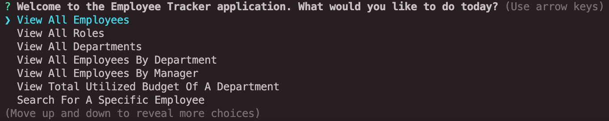
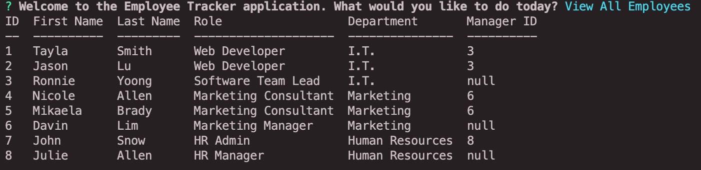
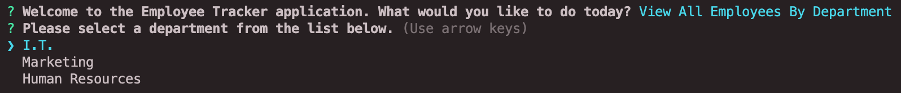
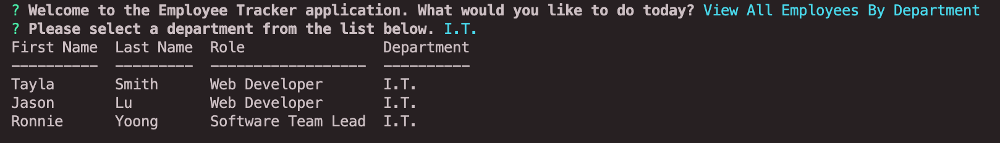

# Employee Tracker Application
Project Owner: Aaron Au Yoong
<br>
A video demo of the application can be found [here](https://www.youtube.com/watch?v=vUprIIN-5Gs&ab_channel=AaronAuYoong).
<br>
[](https://choosealicense.com/licenses/mit/)

## Table of Contents
* [Description](#Description)
* [License](#License)
* [Installation](#Installation)
* [Usage](#Usage)
* [Contributions](#Contributions)
* [Credits](#Credits)
* [Tests](#Tests)
* [Questions](#Questions)

## Description

The Employee Tracker application is a command-line application that allows the user to:

  * Add departments, roles, employees

  * View departments, roles, employees

  * Update employee roles

  * Update employee managers

  * View employees by manager

  * Delete departments, roles, and employees

  * View the total utilized budget of a department -- I.E. the combined salaries of all employees in that department

Below is the defined User Story for this application:

```
As a business owner
I want to be able to view and manage the departments, roles, and employees in my company
So that I can organize and plan my business
```

`The "employee_db" database structure is illustrated below.`


* **department** table:

  * **id** - INT PRIMARY KEY
  * **name** - VARCHAR(30) to hold department name

* **role** table:

  * **id** - INT PRIMARY KEY
  * **title** -  VARCHAR(30) to hold role title
  * **salary** -  DECIMAL to hold role salary
  * **department_id** -  INT to hold reference to department role belongs to

* **employee** table:

  * **id** - INT PRIMARY KEY
  * **first_name** - VARCHAR(30) to hold employee first name
  * **last_name** - VARCHAR(30) to hold employee last name
  * **role_id** - INT to hold reference to role employee has
  * **manager_id** - INT to hold reference to another employee that manages the employee being Created. This field may be null if the employee has no manager

A seed.sql file is included with sample data inside. The sample data was used to conduct tests for each function created. Results of the tests can be found in the video demo, and screenshots found under the "Test" section below.

Technologies used in this application include JavaScript, Node Packages and MySQL.
## License
MIT License
<br>
Copyright © 2021-Present Aaron Au Yoong. All rights reserved.
<br>

## Installation
If you would like to install the employee tracker app to your local computer, please follow the installation steps below. 

1. Download this repository `employee-tracker`.

2. Install npm basic packages by running the following command in your bash/terminal:

````
npm i -y
````

3. Install required dependencies by invoking the commands below. These include the Inquirer, MySQL and console table (cTable) NPM Packages.

````
npm i inquirer
npm i mysql
npm i console.table
````

Congratulations! You have successfully installed the employee tracker application in your local computer. 

## Usage

[Video Demo](https://www.youtube.com/watch?v=vUprIIN-5Gs&ab_channel=AaronAuYoong)

1. Ensure you have all the files from `employee-tracker` downloaded into your system.

2. Ensure you have npm packages installed. You may do so via executing the following command in your CLI (Command Line Interface):
```bash
npm init
```

```bash
npm i -y
```

Most importantly, ensure that you install the inquirer, mysql and console.table packages:

```bash
npm i inquirer
npm i mysql
npm i console.table
```

3. To run the application, please enter the following into your CLI:
```bash
node index.js
```

4. Using the arrow keys, select appropriate actions to begin making use of the employee tracker application.
<br>
<br>

<br>
<br>
## Contributions
For contributions, you may follow the industry standard: [Contributor Covenant](https://www.contributor-covenant.org/)

## Credits
License badges used in this project were retrieved from GitHub user's `lukas-h` license-badge markdown file: [Markdown License badges](https://gist.github.com/lukas-h/2a5d00690736b4c3a7ba).

Basic NPM Packages were used: [NPM Packages](https://www.npmjs.com/).
Inquirer NPM Package was used: [Inquirer NPM Package](https://www.npmjs.com/package/inquirer/v/0.2.3).
MySQL NPM Package was used: [MySQL](https://www.npmjs.com/package/mysql).
Console.table NPM Package was used: [console.table](https://www.npmjs.com/package/console.table).

Banner for README retrieved from [PingCAP](https://pingcap.com/blog/tidb-lite-go-sqlmock-alternative-for-easily-unit-testing-golang-database-related-code).

Music backtrack used in the application's video demo: `Above the Clouds` by `amies`. 
<br>

Artist and song credits are as follows:
- [Amies' SoundCloud Profile](https://soundcloud.com/officialamies).
- [Above The Clouds YouTube Sample](https://www.youtube.com/watch?v=uEJuTsgqgA0&ab_channel=CloudhopMusicCloudhopMusic).

## Tests
Sample data from `seed.sql` was used for testing. Some screenshots of the tests are below. 

1. Testing for viewAllEmployees function. 

<br>

2. Testing for viewEmployeesByDepartment function. 
- Prompts you to select a department.

<br>
- Results are shown.

<br>

Elaborate testing is demonstrated in the [video demo](https://www.youtube.com/watch?v=vUprIIN-5Gs&ab_channel=AaronAuYoong). 

## Questions
Any questions? Feel free to contact me via my GitHub profile: [Aaron Au Yoong's GitHub Profile](https://github.com/aaronauyoong)
